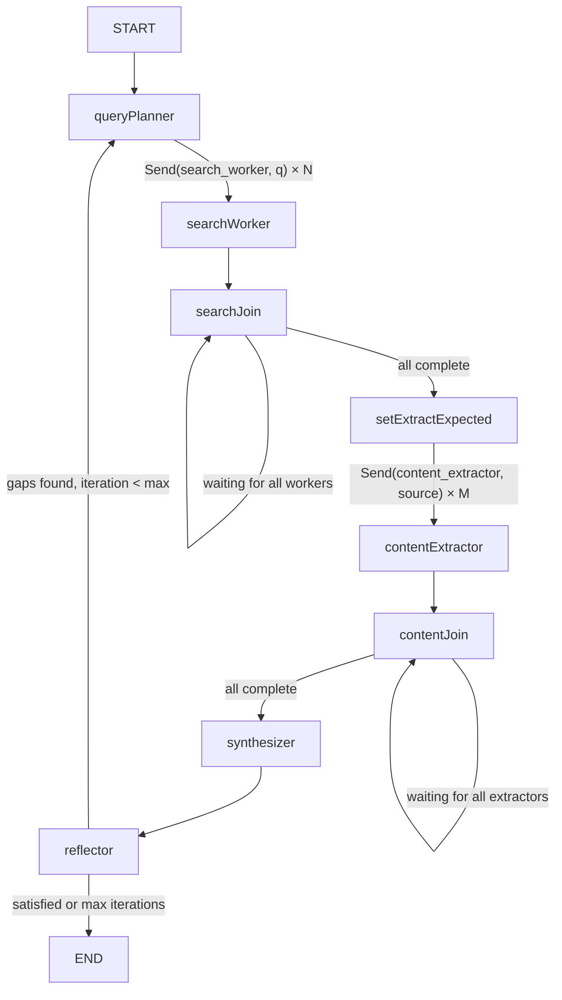

# Scout — AI Research Assistant

Scout is an AI-powered research assistant that autonomously investigates any topic and delivers a structured, sourced report. You provide a query; Scout's agent breaks it into targeted sub-questions, searches the web, reads and extracts relevant information, and synthesizes everything into a clean, readable report — showing its reasoning at every step.

**Live demo:** _(deploy link here)_

---

## What Makes Scout Different

Unlike a simple chatbot or search engine, Scout:

- **Reasons iteratively** — it searches, reflects on gaps, and searches again (up to 3 iterations by default)
- **Pursues multiple angles** — each query is decomposed into 3–5 focused sub-questions searched in parallel
- **Shows its work** — every agent step streams to the UI in real time so you can see exactly how it arrived at its conclusions
- **Cites sources** — every claim in the report links back to a specific web source

---

## Architecture

### LangGraph State Graph



### Data Flow

```
User Query
    │
    ▼
POST /research ──────────────────────────────────────────────┐
(HTTP 202, returns job_id)                                    │
    │                                                         ▼
GET /research/{job_id}/stream ◄── SSE ◄── asyncio.Queue ◄── LangGraph Agent
    │                                                         │
    ▼                                                    ┌────┴──────────────┐
React Frontend                                          │  query_planner    │
├── ProgressPanel (live steps)                          │  search_worker ×N │
└── ReportPanel (final report)                          │  content_extractor│
                                                        │  synthesizer      │
                                                        │  reflector        │
                                                        └───────────────────┘
```

### Agent State

```python
class ResearchState(TypedDict):
    query: str
    sub_queries: list[str]
    search_results: Annotated[list[dict], add]   # parallel reducer
    extracted_docs: Annotated[list[dict], add]   # parallel reducer
    answer_draft: str
    citations: list[str]
    report: dict | None
    iteration: int
    max_iterations: int                          # default: 3
    done: bool
    remaining_steps: RemainingSteps              # LangGraph safety net
```

---

## Tech Stack

| Layer | Technology |
|---|---|
| LLM | Gemini 2.0 Flash (`langchain-google-genai`) |
| Web Search | Tavily API (`tavily-python`) |
| Agent Framework | LangGraph v1.0+ (`StateGraph`) |
| Backend | FastAPI + uvicorn |
| Streaming | Server-Sent Events (SSE) via `asyncio.Queue` |
| Frontend | React 18 + TypeScript + Vite |
| Styling | Tailwind CSS |
| Prompt Templates | Jinja2 `.j2` files |

---

## Prompt Engineering

All prompts live in [`backend/app/prompts/`](backend/app/prompts/) as Jinja2 templates. This keeps prompt logic version-controlled and separate from Python code.

### `query_decomposition.j2`

**Purpose:** Decompose a broad user query into 3–5 focused, searchable sub-questions.

**Design rationale:** The most critical prompt in the system. A bad decomposition cascades into poor search results and a weak report. The prompt explicitly instructs the model to cover *different angles* (not just rephrase the same question), and in loop iterations it receives the previous sub-queries to avoid redundancy.

**Output:** `{ "queries": [...], "reasoning": "..." }` — structured JSON for reliable parsing.

### `content_extraction.j2`

**Purpose:** Given a raw web page and the research context, extract a concise summary, key facts, and a relevance rating.

**Design rationale:** Tavily returns raw markdown content that can be thousands of tokens. This prompt compresses each source into a structured `{ summary, key_facts[], relevance, citation }` object before synthesis, preventing the synthesis prompt from being overwhelmed with raw text.

### `synthesis.j2`

**Purpose:** Combine all extracted documents into a structured research report with inline citations.

**Design rationale:** Uses Gemini's structured output (`response_schema`) to guarantee a consistent JSON shape (`title`, `summary`, `key_findings[]`, `sections[]`, `conclusion`, `citations[]`). The prompt explicitly instructs the model to use `[Source N]` inline citations so the frontend can link them.

### `reflection.j2`

**Purpose:** Evaluate whether the current findings adequately answer the query, and identify gaps that warrant another search iteration.

**Design rationale:** The reflector is the loop controller. It receives the current answer draft and the list of sub-questions already searched, then decides whether `should_continue: true/false`. The prompt includes the current iteration count and max iterations, so the model knows when it's on its final pass and must wrap up.

---

## Project Structure

```
scout-research-assistant/
├── backend/
│   ├── app/
│   │   ├── main.py                  # FastAPI app, CORS, lifespan
│   │   ├── models.py                # Pydantic request/response models
│   │   ├── api/
│   │   │   └── research.py          # Route handlers (POST, SSE stream, result)
│   │   ├── agent/
│   │   │   ├── state.py             # ResearchState TypedDict
│   │   │   ├── graph.py             # LangGraph StateGraph wiring
│   │   │   ├── runner.py            # astream wrapper + asyncio.Queue bridge
│   │   │   └── nodes/
│   │   │       ├── query_planner.py
│   │   │       ├── search_worker.py
│   │   │       ├── content_extractor.py
│   │   │       └── synthesizer.py   # also contains reflector node
│   │   └── prompts/
│   │       ├── query_decomposition.j2
│   │       ├── content_extraction.j2
│   │       ├── synthesis.j2
│   │       └── reflection.j2
│   ├── requirements.txt
│   └── .env.example
├── frontend/
│   ├── src/
│   │   ├── App.tsx                  # Root layout (split panel)
│   │   ├── types.ts                 # Shared TypeScript types
│   │   ├── components/
│   │   │   ├── QueryInput.tsx       # Search bar + settings
│   │   │   ├── ProgressPanel.tsx    # Live agent step timeline
│   │   │   └── ReportPanel.tsx      # Final report renderer + export
│   │   └── hooks/
│   │       └── useResearch.ts       # SSE streaming + job state
│   ├── vite.config.ts
│   ├── tailwind.config.js
│   └── package.json
└── README.md
```

---

## Local Setup

### Prerequisites

- Python 3.11+
- Node.js 18+
- A [Google AI Studio](https://aistudio.google.com/app/apikey) API key (free)
- A [Tavily](https://tavily.com) API key (free tier: 1000 searches/month)

### Backend

```bash
cd backend

# Create and activate a virtual environment
python -m venv .venv
source .venv/bin/activate  # Windows: .venv\Scripts\activate

# Install dependencies
pip install -r requirements.txt

# Configure environment variables
cp .env.example .env
# Edit .env and add your GOOGLE_API_KEY and TAVILY_API_KEY

# Start the server
uvicorn app.main:app --reload --port 8000
```

The API will be available at `http://localhost:8000`. Interactive docs at `http://localhost:8000/docs`.

### Frontend

```bash
cd frontend

# Install dependencies
npm install

# Start the dev server (proxies /research to localhost:8000)
npm run dev
```

Open `http://localhost:5173` in your browser.

---

## API Reference

| Method | Endpoint | Description |
|---|---|---|
| `POST` | `/research` | Start a research job. Body: `{ "query": "...", "max_iterations": 3 }`. Returns `{ "job_id": "..." }` (HTTP 202). |
| `GET` | `/research/{job_id}/stream` | SSE stream of agent progress events. |
| `GET` | `/research/{job_id}/result` | Final report (HTTP 202 if still running). |
| `GET` | `/health` | Health check. |

### SSE Event Schema

```json
// Agent step
{ "type": "step", "step": "searching", "message": "Searching: 'AI safety 2025'", "iteration": 1 }

// Warning (non-fatal error)
{ "type": "warning", "message": "Search failed for query X, continuing..." }

// Research complete
{ "type": "complete", "report": { "title": "...", "summary": "...", "key_findings": [], "sections": [], "conclusion": "...", "citations": [] } }

// Fatal error
{ "type": "error", "message": "..." }
```

---

## Deployment

### Backend (Railway / Render)

1. Set environment variables: `GOOGLE_API_KEY`, `TAVILY_API_KEY`, `ALLOWED_ORIGINS`
2. Start command: `uvicorn app.main:app --host 0.0.0.0 --port $PORT`

### Frontend (Vercel / Netlify)

1. Set `VITE_API_BASE_URL` to your deployed backend URL
2. Update `vite.config.ts` proxy target or configure the frontend to use the env variable
3. Build command: `npm run build`, output directory: `dist`

---

## License

MIT
